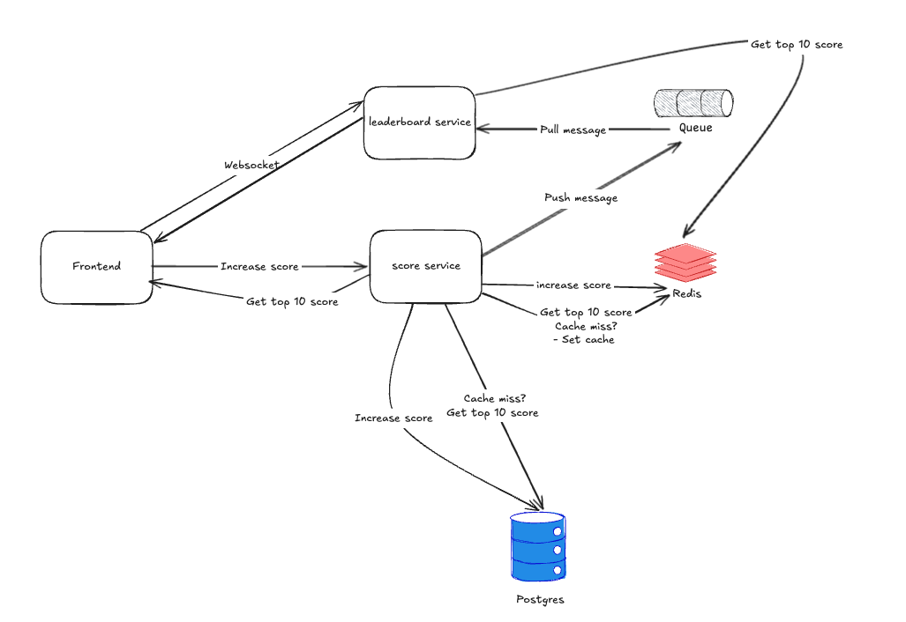
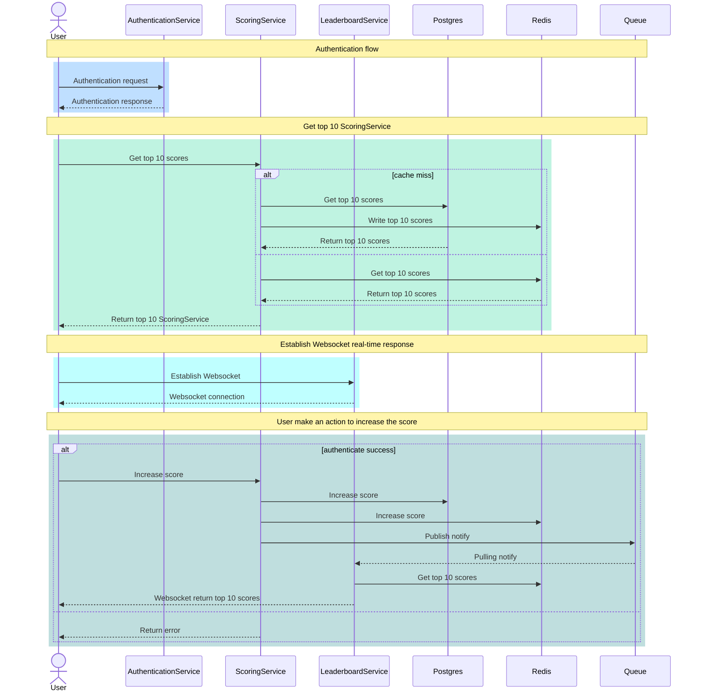
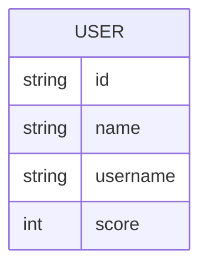

# Problem 6: Architecture

## Requirement
- We have a website with a score board, which shows the top 10 user’s scores.
- We want live update of the score board.
- User can do an action (which we do not need to care what the action is), completing this action will increase the user’s score.
- Upon completion the action will dispatch an API call to the application server to update the score.
- We want to prevent malicious users from increasing scores without authorisation.

## High Level Design



### Explain:
- Firstly, user access the website, there is an websocket connection is established
- The website call API to get 10 scores, the score service will get top 10 scores from the cache(Redis)
- If there is no cached data, the server will get top 10 scores from the database(Postgres), then write to cache for later
- User need to authenticate before make an action
- When user make an action to increase score and the access token (JWT), the score service write data to the database(Postgres) and the cache(Redis), publish an notification to queue
- The leaderboard service will run real-time to receive the notification from queue, get top 10 scores from the cache(Redis)
- Finally, push data to user via the websocket

## Detail Design

### Sequance Flow


### Database Design
1. Database


### API
<b>1. Authenticate</b>
- Method: POST
- Path: `/login`
- Request:
```
{
    "username": "",
    "password": ""
}
```
- Response:
```
{
    "accessToken": ""
}
```

<b>2. Get top 10 scores:</b>
- Method: GET
- Path: `/scores`
- Response:
```
{
    scores: [
        {
            username: "",
            score: ""
        },
        {
            username: "",
            score: ""
        }
    ]
}
```

<b>3. Make an action to increase score:</b>
- Method: POST
- Path: `/scores/action`
- Header:
```
Authorization: Bearer ${accessToken}
```
- Response:
```
{
    "message": "Make action success"
}
```

<b>4. Queue data:</b>
- Data:
```
{
    "eventType": "live.update",
    "data": {
        "username": ""
    }
}
```

<b>4. Real-time live update score:</b>
- Front-end establish to the websocket `/leaderboard/live`
- Back-end connect the Front-end by the websocket via the Leaderboard service
- The Leaderboard service will send data whenever there is new data
- Data:
```
{
    scores: [
        {
            username: "",
            score: ""
        },
        {
            username: "",
            score: ""
        }
    ]
}
```

## Improvement
To prevent malicious users from increasing scores without authorisation:
- Use CloudFlare to acts as a reverse proxy and CDN to filter traffic before it reaches your server.
- Setting Rate-limiting rules
- Using debounce utility to prevent firing the API too frequently